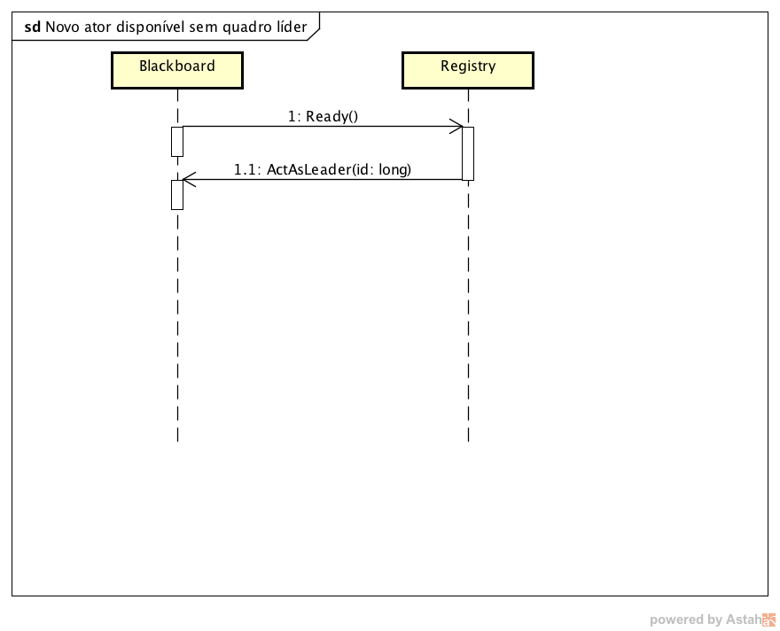
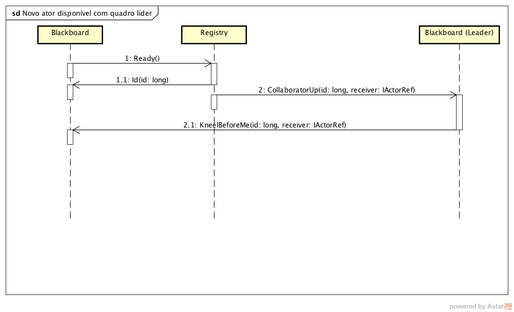

# Projeto Quadro-negro compartilhado (Blackboard)

**Intenção do projeto**

> Criar um quadro-negro, superfície para desenhos, o qual compartilha os seus desenhos com os demais
> quadros abertos, na mesma rede, em tempo real.
>
> Toda comunicação entre os quadros deverá ser feita através de troca de mensagens, usando o Middleware
> **Akka** para a transferência das mensagens entre os quadros.
>
> No Akka, um ator é identificado, de forma simplificada, por uma url no formato 
> `akka.tcp://{Ip da máquina}:{Porta}/user/{Nome do ator}`
> será necessário conhecer um determinado endereço para então
> se comunicar com o ator naquele sistema de atores. Logo, será necessário uma forma externa para que os atores
> possam se localizar.
>
> **Para simplificar a implementação**, usaremos um aplicativo singleton, para registro de atores externos.
> Sua função será catalogar os quadros disponíveis na rede e verificar se os quadros estão funcionamento corretamente,
> iniciando a eleição do quadro líder, assim que o líder cair.

**Observação:**

_Quem iniciou o trabalho usando a definição inicial que usava multicast para a descoberta do serviço, poderá
entregá-la sem alteração!_

## Mensagens trocadas entre atores

As mensagens serão objetos simples e serializáveis para transferência de dados. Utilizaremos a seguinte notação, inspirada nas
classes em Scala e Kotlin, para definir as nossas mensagens:

**Mensagem de exemplo `Ping()`**

Representa uma mensagem do tipo `Ping`, sem parâmetros. 

Implementação em Java:

```java

public class Ping implements Serializable {
	
}

```

Implementação em C#:

```csharp

[Serializable]
public class Ping
{
}

```


**Mensagem `Hello(name: string)`**

Representa uma mensagem do tipo `Hello`, com um parâmetro `name`, do tipo `string`. Se houvessem mais parâmetros,
estes podem ser listados dentro dos parênteses, separados por vírgula.

Implementação em Java:

```java

public class Hello implements Serializable {
	public final String name;

	public Hello(String name) {
		this.name = name;
	}
}

```

Implementação em C#:

```csharp

[Serializable]
public class Hello 
{
	public readonly string Name;
	
	public Hello(string name)
	{
		Name = name;
	}
}

```

É importante notar que nesta notação, as implementações dos objetos de transporte não definem métodos para acesso, métodos `get` e `set`.
Todas as classes de objetos de transporte deverão seguir este padrão para garantir a compatibilidade entre os quadros.
As classes em Java deverão estar contidas no pacote `blackboard.messages`, enquanto que, em C#, deverão estar no namespace `Blackboard.Messages`.


# Registro de quadros

Neste Modelo de Sistema, teremos uma aplicação que irá funcionar como registro
para novos quadros. Seu papel será registrar novos quadros disponíveis e eleger
o quadro líder, sempre que houver necessidade. Esta aplicação não terá qualquer
tipo de interface gráfica e apenas atenderá a pedidos externos.

Ao iniciar, essa aplicação deverá registrar e disponibilizar um `Actor` para 
tratar as mensagens oriundas de quadros na rede. Para isso, deverá manter
uma de quadros disponíveis para comunicação.

**Fluxo de comunicação**

O `Actor` registrado para tratar as mensagens externas deverá ter o nome `registry`,
estando definido sobre o endereço `akka.tcp://blackboard@localhost:4000/user/registry`.
Chamaremos este de `RegistryActor`.

Quando este ator receber a mensagem `Ready()` de algum quadro, este deverá guardar
sua referência em uma lista local. Ao registrar o quadro, o **RegistryActor** deverá
informar a identificação do quadro a este, através da mensagem `Id(id: long)`.

Se houver um **quadro líder**, este deverá avisar o líder que existe um novo 
**quadro colaborador** disponível na rede, enviando a este a mensagem 
`CollaboratorUp(id: long, receiver: IActorRef)`. Caso contrário,
este deverá enviar ao novo quadro, que este deverá agir como o **líder**, enviando
a este a mensagem `ActAsLeader(id: long)`.

A cada 10 segundos, o **RegistryActor** deverá checar se os quadros ainda estão funcionais,
enviando uma mensagem `Ping()` e aguardando um tempo (olhe o padrão `ask` no akka).
Se o quadro estiver funcional, este deverá retornar uma mensagem `Pong()`. Se estourar o
tempo de 5 segundos e não houver a resposta, este deverá remover o quadro da lista de 
quadros e enviar a mensagem `CollaboratorDown(id: long)`. Se o quadro não responder
e esse for o **líder**, então o **RegistryActor** deverá iniciar o processo
de eleição, escolhendo o próximo líder (o quadro disponível com o id mais baixo), e enviando
a este quadro a informação que é o novo líder, através da mensagem `ActAsLeader()`.




# Funcionamento dos quadros

Ao iniciar, o quadro irá iniciar o seu sistema de atores e então enviar a mensagem `Ready()`
ao **ActorRegistry**. Este receberá uma mensagem `Id(id: long)`, contendo a sua identificação,
definida pelo **ActorRegistry**.

Esse quadro poderá receber a mensagem `ActAsLeader()`, o qual informará a este quadro que ele é o líder.
Caso contrário, receberá a mensagem `KneelBeforeMe(id: long, receiver: IActorRef)` do quadro
líder, então deverá agir como colaborador.

Toda vez que houver troca de líder, este quadro receberá a mensagem `KneelBeforeMe(id: long, receiver: IActorRef)` 
do novo líder.

## Líder

O papel do líder é armazenar a lista de desenhos enviados por todos os outros
quadros. Toda vez que um quadro quiser desenhar uma nova forma, este enviará ao **líder** a mensagem
`Draw(shape: Shape)` (contendo as informações do desenho - as
cores estão no formato hexadecimal de 24bit - #ffffff, a cor branca). 

O **líder** ao receber a mensagem `Draw`, armazenará na lista de desenhos interna e então 
avisará todos os demais quadros que existe um desenho novo, através da mensagem 
`Drawn(shape: Shape)`.

## Colaborador

O papel do colaborador é contribuir com novos desenhos ao quadro. Toda vez que um usuário
desenhar uma nova forma, este deverá enviar ao líder a mensagem `Draw(shape: Shape)`.

Somente quando este quadro receber a mensagem `Drawn(shape: Shape)`, do **líder**, é que 
deverá atualizar a lista de desenhos locais.


